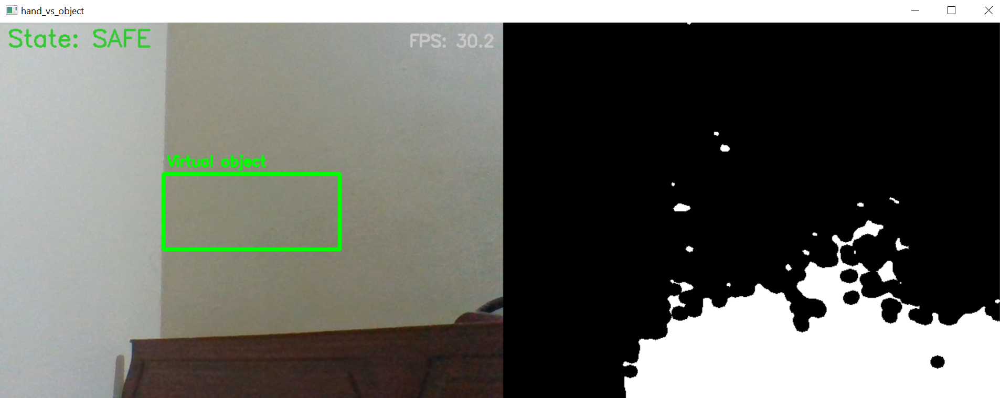
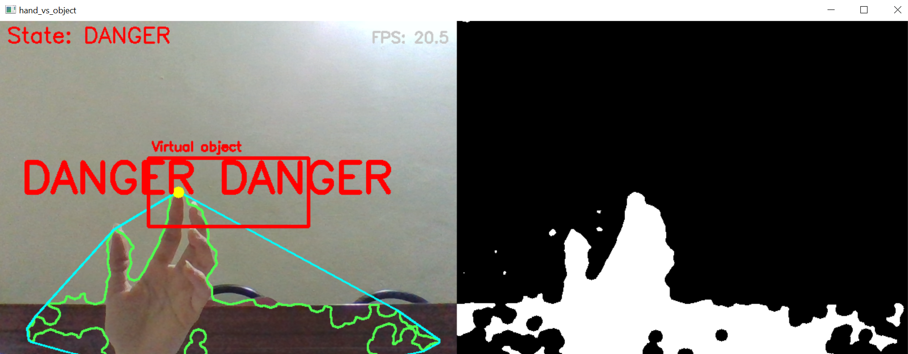
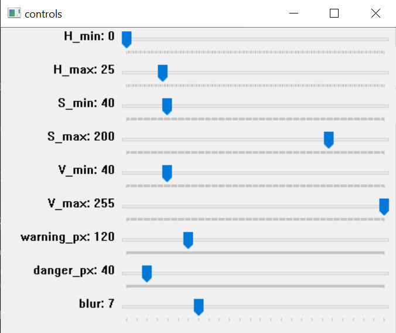

# Hand Boundary Detection POC

**Prototype**: Real-time hand/fingertip tracking + virtual object boundary (CPU-only, OpenCV)

## Overview
- Detects hand via HSV skin segmentation + contours + convex hull (no MediaPipe/OpenPose).
- Draws a virtual rectangular object on the live webcam feed.
- Computes distance from fingertip to object and classifies states: SAFE / WARNING / DANGER.
- Displays **DANGER DANGER** when in danger state.
- Target: ≥ 8 FPS on CPU (tested on 640×480).

## Files
- `hand_boundary_poc.py` — main demo script (OpenCV + NumPy)
- `requirements.txt` — Python dependencies
- `demo/demo_video.mp4` — short demo showing SAFE → WARNING → DANGER (optional)

## Requirements
```bash
python 3.8+
pip install -r requirements.txt

## State Visuals

### 🟢 SAFE Zone
This image shows when the hand is far from the boundary — fully safe.


### 🔴 DANGER Zone
This image shows the fingertip touching/entering the boundary — danger state is triggered.


### ⚙️ CONTROL Reference
This image is used for adjusting or referencing the boundary placement.

